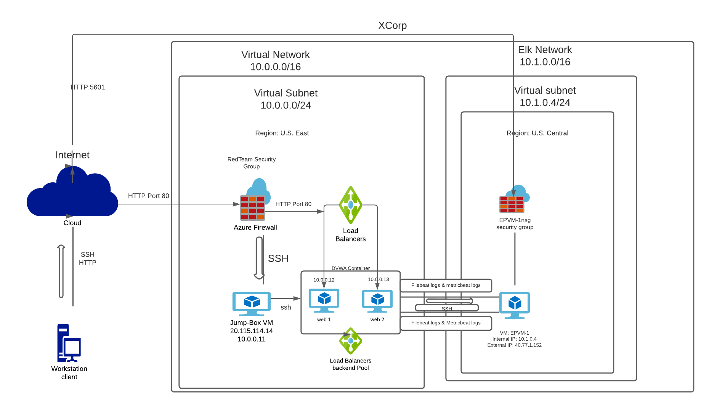
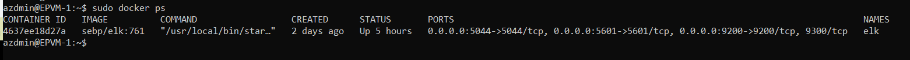

## Automated ELK Stack Deployment

The files in this repository were used to configure the network depicted below.

These files have been tested and used to generate a live ELK deployment on Azure. They can be used to either recreate the entire deployment pictured above. Alternatively, select portions of the _____ file may be used to install only certain pieces of it, such as Filebeat.

  -  

This document contains the following details:
- Description of the Topology
- Access Policies
- ELK Configuration
  - Beats in Use
  - Machines Being Monitored
- How to Use the Ansible Build

### Description of the Topology

The main purpose of this network is to expose a load-balanced and monitored instance of DVWA, the D*mn Vulnerable Web Application.

Load balancing ensures that the application will be highly available, in addition to restricting access to the network.
-load balancer defends an organization against DDoS attacks. It does this by shifting attack traffic from the corporate server to a public cloud provider.
-The advantages of a Jump Box is that it helps minimize attacks by ensuring remote connections to the cloud come through one VM.

Integrating an ELK server allows users to easily monitor the vulnerable VMs for changes to the Configuration and system files.
- Filebeat is used to monitor log files.
- Metricbeat takes the metrics and statistics that it collects and ships them to the output that you specify, such as Elasticsearch or Logstash

The configuration details of each machine may be found below.

| Name     | Function | IP Address | Operating System |
|----------|----------|------------|------------------|
| Jump Box | Gateway  | 10.0.0.11  | Linux            |
| Web 1    | DVWA     | 10.0.0.12  | Linux            |
| Web 2    | DVW      | 10.0.0.13  | Linux            |
| EPVM-1   | ELK      | 10.1.0.4   | Linux            |

### Access Policies

The machines on the internal network are not exposed to the public Internet.

Only the Jump Box machine can accept connections from the Internet. Access to this machine is only allowed from the following IP addresses:
- 20.124.13.26

Machines within the network can only be accessed by Jump Box.
- The jump Box allows you to access the Elk VM. The IP address is 10.0.0.11

 A summary of the access policies in place can be found in the table below.

| Name     | Publicly Accessible | Allowed IP Addresses |
|----------|---------------------|----------------------|
| Jump Box | yes                 | My IP                |
| Web 1    | no                  | 10.0.0.12            |
| Web 2    | no                  | 10.0.0.13            |
| EPVM-1   | yes                 | My IP                |

### Elk Configuration

Ansible was used to automate configuration of the ELK machine. No configuration was performed manually, which is advantageous because...
- Service running can be limited, systems installation and update can be streamlined, and processes become more replicable.

The playbook implements the following tasks:
- Install docker.io
- Install python3-pip3
- Install Docker Python module
- Increase memory for the Elk stack.

The following screenshot displays the result of running `docker ps` after successfully configuring the ELK instance.

### Target Machines & Beats
This ELK server is configured to monitor the following machines:
- Web1: 10.0.0.12
- Web2: 10.0.0.13

We have installed the following Beats on these machines:
- Filebeat.
 -Metricbeat

These Beats allow us to collect the following information from each machine:
-Filebeat: Filebeat collect and monitors the log directories from VMs that are running, tails the files and sends them to elasticsearch or logstash.
-Metricbeat collects metric and statistics on the system which can be used to monitor the systems health.
### Using the Playbook
In order to use the playbook, you will need to have an Ansible control node already configured. Assuming you have such a control node provisioned:

SSH into the control node and follow the steps below:
- Copy the config file to Ansible Container.
- Update the etc/ansible/hosts to include the IP address of the Elk Server and webservers.
- Run the playbook, and navigate to http://[Elk_VM_Public_IP]:5601/app/kibana to check that the installation worked as expected.

- _Which file is the playbook? elk_project.yml.  
- _Which file do you update to make Ansible run the playbook on a specific machine? The Ansible.cfg file. How do I specify which machine to install the ELK server on versus which to install Filebeat on? By changing the IP addresses.
- _Which URL do you navigate to in order to check that the ELK server is running?http://13.89.7.129:5601/app/kibana

_As a **Bonus**, provide the specific commands the user will need to run to download the playbook, update the files, etc.
